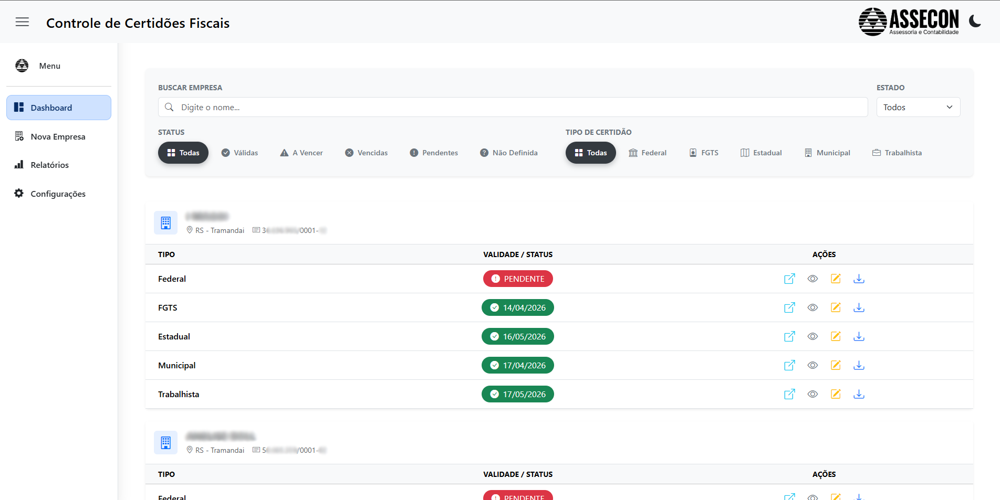

# 📋 Sistema de Controle de Certidões Fiscais - Python (⚠️ Em Desenvolvimento..)

Sistema web desenvolvido em **Python/Flask** para centralizar, gerenciar e automatizar a emissão de certidões fiscais (Federal, FGTS, Estadual, Municipal e Trabalhista).
Projetado para escritórios contábeis, o sistema permite que múltiplos usuários trabalhem simultaneamente, com automação local e banco de dados centralizado.



---

## 🎯 Sobre o Projeto

Este sistema foi criado para resolver o problema de controle manual de centenas de vencimentos de certidões. Ele transforma uma tarefa repetitiva e propensa a erros em um processo fluido e visual.

**Principais benefícios**
- **Centralização**: Todas as certidões de todas as empresas em uma única tela.
- **Automação Híbrida**: O robô (Selenium) roda no seu computador (permitindo resolver Captchas), mas salva os dados no servidor central.
- **Visualização Rápida**: Cores intuitivas indicam o que precisa de atenção imediata.
- **Segurança**: Banco de dados robusto (MySQL) permitindo acesso simultâneo sem conflitos.

---

## 🛠️ Tecnologias

### Backend
- **Python 3.10+**
- **Flask** - Framework web
- **SQLAlchemy** - ORM + PyMySQL (Driver)
- **Flask-Migrate** - Gerenciamento de banco
- **Selenium WebDriver** - Automação de navegador

### Frontend
- **Bootstrap 5.3** - Framework CSS
- **JavaScript (Vanilla)** - Lógica de interface e chamadas assíncronas
- **HTML/CSS** - Estrutura responsiva e adaptável

### Banco de Dados
- MySQL Server (Recomendado para produção/multiusuário)
- SQLite (Opcional para desenvolvimento local/single-user)

---

## ✨ Funcionalidades
📊 **Dashboard Inteligente**

- **Status Visual**:
  - 🟢 **Verde**: Válida (> 7 dias)
  - 🟡 **Amarelo**: A Vencer (≤ 7 dias)
  - 🔴 **Vermelho**: Vencida ou Pendente
  - ⚪ **Cinza**: Sem data

- **Dark Mode Automático**: Detecção de preferência do sistema + botão de troca manual (Persistente).

- **Responsividade**: Tabela e menus se adaptam a telas pequenas e zoom alto.

🤖 **Automação de Emissão**
  - **Federal (Receita)**: Monitoramento inteligente de download. O sistema detecta quando o PDF cai na pasta Downloads e o move automaticamente.
  - **FGTS / Estadual / Trabalhista**: Navegação automática até a página de emissão e preenchimento de CNPJ.
  - **Municipal**: Suporte configurável para sites de prefeituras (ex: Gravataí, Xangri-Lá, Cidreira, etc.) com lógica personalizada para sistemas complexos.

**📁 Gestão de Arquivos (File Server)**
  - O sistema varre a pasta de Downloads local.
  - Identifica o PDF da certidão (com filtro inteligente de nomes para evitar conflitos).
  - Renomeia e Move automaticamente para a pasta da empresa na rede (ex: Z:\PASTAS EMPRESAS\Cliente X\CERTIDOES\CERTIDAO FGTS.pdf).
  - Evita duplicação de pastas (reconhece CERTIDOES e CERTIDÕES).

**🔍 Filtros Avançados**
- **Busca Instantânea**: Filtre empresas por nome digitando poucas letras.
- **Filtros de Status**: Veja apenas as "Vencidas" ou "Pendentes" com um clique.

---

## 📦 Instalação

### Pré-requisitos
- Python 3.10 ou superior
- Google Chrome instalado
- Git
- MySQL Server

### Passo a Passo

1. **Clone o repositório**
```powershell
git clone https://github.com/nicolasaoliveira1/CertidoesPython.git
cd CertidoesPython
```

2. **Crie um ambiente virtual**
```powershell
python -m venv venv
.\venv\Scripts\Activate.ps1
```

3. **Instale as dependências**
```powershell
pip install -r requirements.txt
```

4. **Configure as variáveis de ambiente** (opcional)

Crie um arquivo `.env` na raiz do projeto:
```env
# Para MySQL (Recomendado)
# SQLALCHEMY_DATABASE_URI = 'mysql+pymysql://usuario:senha@IP_DO_SERVIDOR/sistema_certidoes'

# Para SQLite (Desenvolvimento)
# SQLALCHEMY_DATABASE_URI = 'sqlite:///instance/database.db'
```

5. **Inicialize o banco de dados**
```powershell
flask db upgrade
```
6. ** Configurar Caminhos de Rede (app/file_manager.py)
```powershell
CAMINHO_REDE = r"Z:\PASTAS EMPRESAS"  # Ajuste para o seu servidor
```

7. **Execute a aplicação**
```powershell
python run.py
# Acesse: http://localhost:5000
```
---

## ⚙️ Configuração

### 📂 Caminho de Salvamento das Certidões

⚠️ **IMPORTANTE**: Você deve configurar o caminho onde as certidões serão salvas.

Edite o arquivo `app/file_manager.py` ou `app/routes.py` e defina o caminho base:

```python
# Exemplo: caminho para servidor local ou rede
CERTIDOES_BASE_PATH = r"C:\CaminhoDoServidor\CERTIDOES"
# ou
CERTIDOES_BASE_PATH = r"\\ServidorRede\Compartilhado\CERTIDOES"
```

**Estrutura de pastas criada automaticamente:**
```
CERTIDOES/
├── Empresa 1/
│   ├── Federal_CNPJ_20250101.pdf
│   ├── FGTS_CNPJ_20250101.pdf
│   └── ...
├── Empresa 2/
│   └── ...
```

### 🏛️ Configuração de Municípios

Para adicionar automação de certidões municipais:

1. Acesse o banco de dados (`instance/database.db`)
2. Insira um registro na tabela `municipio`:
   - `nome`: Nome do município
   - `url_certidao`: URL do site da prefeitura
   - `cnpj_field_id`: Seletor do campo CNPJ
   - `by`: Tipo de seletor (`id`, `name`, `css_selector`, etc.)
   - Campos opcionais para inscrição mobiliária e shadow DOM

---

## 🗂️ Estrutura do Projeto

```
CertidoesPython/
├── app/
│   ├── __init__.py              # Inicialização do Flask
│   ├── models.py                # Modelos do banco de dados
│   ├── routes.py                # Rotas e lógica de negócio
│   ├── automation.py            # Configurações de automação
│   ├── file_manager.py          # Gerenciamento de arquivos
│   ├── static/
│   │   ├── css/
│   │   │   └── style.css        # Estilos customizados
│   │   └── images/              # Logos e ícones
│   └── templates/
│       ├── base.html            # Template base
│       └── dashboard.html       # Dashboard principal
├── migrations/                   # Migrations do Alembic
├── instance/
│   └── database.db              # Banco de dados SQLite
├── config.py                    # Configurações da aplicação
├── run.py                       # Ponto de entrada
├── requirements.txt             # Dependências Python
└── README.md                    # Este arquivo
```

---

## 🚀 Uso

### Adicionar Empresa
1. No dashboard, clique em "Adicionar Empresa"
2. Preencha: Nome, CNPJ, Cidade, Inscrição Mobiliária (opcional)
3. As 5 certidões são criadas automaticamente

### Abrir Site Certidão (IMPORTANTE: utilize esse botão para emitir certidões federais)
1. Clique no botão "Abrir Site" na certidão desejada
2. O sistema abre uma aba ao lado no site de emissão e copia o CNPJ da empresa para colar
3. Baixe o PDF em Downloads e ele será movido para a pasta configurada
4. Feche o site e volte ao sistema para confirmar validade da certidão

### Emitir Certidão Automaticamente
1. Clique no botão "Baixar" na certidão desejada
2. O sistema abre uma janela anônima no site desejado e preenche os dados automaticamente
3. Baixe o PDF em Download e ele será movido para a pasta configurada
4. Feche a janela do Chrome que foi aberta e volte ao sistema para confirmar a validade da certidão

### Atualizar Validade
1. Clique no botão "Editar" na certidão desejada
2. Informe a nova data de validade
3. Salve

### Marcar como Pendente
1. Após clicar em "Editar", clique em "Marcar como Pendente" no modal
2. A certidão ficará destacada em vermelho e será escrito: "Pendente"

---

## 🔧 Migrations (Alembic)

### Criar nova migration
```powershell
flask db migrate -m "Descrição da alteração"
```

### Aplicar migrations
```powershell
flask db upgrade
```

### Reverter última migration
```powershell
flask db downgrade
```

---

## 🎨 Personalização

### Alterar Tema
- O sistema detecta automaticamente a preferência do sistema
- Use o botão sol/lua no navbar para alternar manualmente
- A preferência é salva no `localStorage`

### Ajustar Logo
Atualmente utiliza a logo do escritório onde trabalho
- Logos em `app/static/images/`
- Logo claro: `asseconlogo.png` (versão completa) e `assecon_preto.png` (compacta)
- Logo escuro: `assecon_branco_logo.png` (completa) e `assecon_branco.png` (compacta)

### Modificar Cores de Status
Edite em `app/templates/base.html`:
```css
.status-verde .date-cell { background-color: #c4ffcf !important; }
.status-amarelo .date-cell { background-color: #fffcaa !important; }
.status-vermelho .date-cell { background-color: #ffb6b8 !important; }
```

---

## 📝 Migrations Aplicadas

1. **eca48a272f38** - Cria tabelas Empresa e Certidão
2. **233660c7e937** - Cria tabela Município para automação
3. **9d46bcffc7cb** - Adiciona status_especial (Pendente)
4. **a4a53448d4b5** - Adiciona segundo campo de preenchimento automático

---

## ⚠️ Limitações Conhecidas

- A automação depende da estabilidade dos sites governamentais
- Mudanças nos sites podem quebrar os seletores (requer atualização manual)
- O download automático do PDF depende das configurações do navegador
- Sites com CAPTCHA não são automatizáveis (pelo menos não agora)
- Requer configuração manual do caminho de salvamento
- Para emissão de certidões municipais não implementadas requer adição de automação do site específico

---

## 🛣️ Roadmap

- [ ] Configuração de caminho via interface web (sem editar código)
- [ ] Download automático completo (salvar PDF sem intervenção)
- [ ] Leitura de PDF via OCR (para ler a data de validade de qualquer certidão)
- [ ] Notificações por e-mail para certidões vencendo
- [ ] Relatórios em Excel/PDF
- [ ] Autenticação de usuários
- [ ] Suporte a mais estados (certidão estadual)

---

## 🤝 Contribuindo

Contribuições são bem-vindas! Sinta-se à vontade para:

1. Fazer um fork do projeto
2. Criar uma branch para sua feature (`git checkout -b feature/NovaFuncionalidade`)
3. Commitar suas mudanças (`git commit -m 'Adiciona nova funcionalidade'`)
4. Push para a branch (`git push origin feature/NovaFuncionalidade`)
5. Abrir um Pull Request

---

## 📄 Licença

Este projeto é de uso interno/privado. Consulte o autor para permissões de uso.

---

## 👤 Autor

Nome: Nicolas Oliveira

Email: eu@nicolasoliveira.dev.br

---

## Status

Iniciado em: 20/10/2025

Em desenvolvimento...
